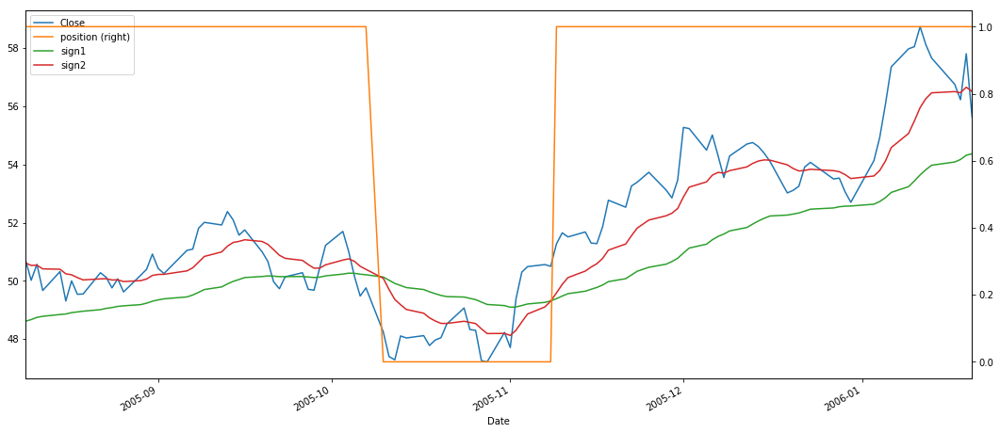

```python
import equity_backtesting_library as elib
import datetime as dt

result = {}
result['instrument'] = 'SOXX'
result['spread'] = 0
result['sign1'], result['sign2'] = elib.strategy_type('medium')
result['margin_used'] = 1
result['funds'] = 50000
result['levarage'] = 1
result['tx_cost'] = 0
result['strategy'] = "soxx_medium"
```

## Load data


```python
import equity_backtesting_library as elib
import datetime as dt

result = {}
result['instrument'] = 'SOXX'
result['spread'] = 0
result['sign1'], result['sign2'] = elib.strategy_type('medium')
result['margin_used'] = 1
result['funds'] = 50000
result['levarage'] = 1
result['tx_cost'] = 0
result['strategy'] = "soxx_medium"
stock = elib.get_ticker('SOXX')
print(stock)
stock.info
df = stock.history(period="max")
df = elib.compute_signals(df, result['sign1'], result['sign2'])
del(df['Dividends'])
del(df['Stock Splits'])
del(df['Open'])
del(df['High'])
del(df['Low'])
df.tail()
```

## Plot of periods of trading


```python
elib.plot_slice(df, '2005-08-08 00:00:00', '2006-01-22 08:13:00')
```





```python
elib.plot_slice(df, '2016-10-08 00:00:00', '2017-01-22 08:13:00')
```


```python
elib.plot_slice(df, '2017-01-02 08:13:00', '2017-01-25 08:13:00')
```


```python
elib.plot_slice(df, '2017-01-03 08:13:00', '2017-01-06 08:13:00')
```


```python
elib.plot_slice(df, '2019-06-10 08:13:00', '2019-10-16 08:13:00')
```


```python
elib.plot_slice(df, '2020-01-01 08:00:00', '2020-04-24 22:13:00')
```


## Calculation of returns


```python
df = elib.long_returns(df, result)
result['total_returns'] = elib.net_returns(
    result['funds'],
    result['margin_used'],
    df,
    result['levarage'])
result['returns'] = elib.inst_returns(
    result['funds'],
    result['margin_used'],
    df,
    result['levarage'])
print('Instrument returns: ', result['returns'])
print('strategy returns: ', result['total_returns'])
result['created_at'] = dt.datetime.utcnow()
print('-----------------------------------------------------')
print("Number of transactions: {}".format(sum(df['position'].diff() != 0)))
result['transaction_cost'] = sum(df['position'].diff() != 0) * \
    result['funds'] * result['margin_used'] * result['levarage'] * result['spread']
#  print("transaction_cost: {}".format(result['transaction_cost']))
print("Transaction cost: {}".format((sum(df['position'].diff() != 0) * 10)))
```

    ('Instrument returns: ', 68083.94595485604)
    ('strategy returns: ', 122485.48105221153)
    -----------------------------------------------------
    Number of transactions: 110
    Transaction cost: 1100


